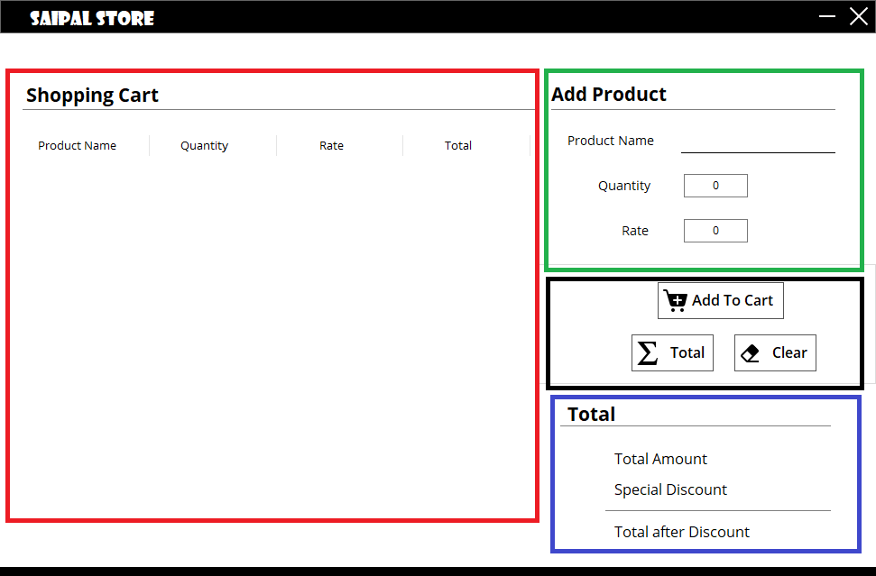
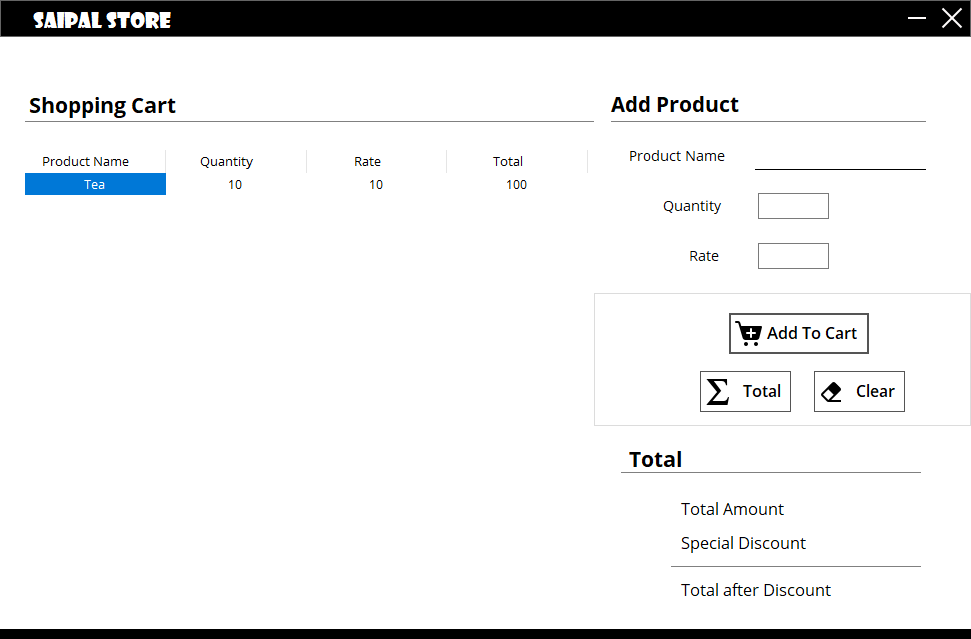

# question_02

Saipal Store has recently been opened in the heart of Tripureshwor. Since there are many departmental stores in the
  same area, the store has decided to offer a special discount on its opening day. The following table illustrates
  discounts based upon the different condition:

<table>
  <tr>
    <th>Purchase Amount</th>
    <th>Discount (%)</th>
  </tr>
  <tr>
    <td>Less than 1000</td>
    <td>2</td>
  </tr>
  <tr>
    <td>More or equal to 1000 but less than 10000</td>
    <td>5</td>
  </tr>
  <tr>
    <td>More or equal to 10000 but less than 20000</td>
    <td>8</td>
  </tr>
  <tr>
    <td>More or equal to 20000 but less than 50000</td>
    <td>10</td>
  </tr>
  <tr>
    <td> More or equal to 50000</td>
    <td>15</td>
  </tr>
</table>

  The shop has decided to develop a computer program <b>preferably a GUI</b> based application that would read the
  details of the purchase made which include the information of <ins>Product Name</ins>, <ins>Rate</ins> and
  <ins>Quantity</ins> and <b>the Amount and the Total Amount be automatically calculated</b>.<i>The program should
    automatically calculate the discount amount and the amount to be paid by the customer.</i>

  
<h1>Documentation</h1>
<h2>Installation</h2>
<h3>Requirements</h3>

  The program is written purely in C#. To compile and run this program, you need to have Visual Studio installed
  alongside .NET 4.5.

<h3>Instructions</h3>

  Here are the instructions to compile and run the program:
  <ol>
    <li>Clone or Download this repository.</li>
    <li>Extract downloaded zip files. <i>(Only if you have downloaded this repository.)</i></li>
    <li>Open <b>SaipalStore.sln</b> in <b>Visual Studio</b>. </li>
    <li>Click on <b>Build and Run</b> in the tool bar.</li>
  </ol>

<h2>Program</h2>

After you successfully build and run the program, it runs a console window which looks similar to this. 
   
  There are four major fields in the application, <b style="color: red;">Data View Area</b>, <b style="color: green;">
    Data Entry Area</b>, <b style="color: black;">Button Area</b>, and <b style="color: blue;">Final Calculations area
  </b> as shown in image here here.  
  

  <h3>Adding Data</h3>
  To add data into the DataGridView
   
  After the operation is complete, the program ends itself. You have to press a key to close the console.

<h2>Known Errors</h2>

  There are mainly two errors that can occur while running this program. Either when no value is added or when
  unacceptable value is added. In the first kind of error, the error looks like this:  
   
  The second kind of error occurs when the entered data is either cannot be converted into integer, <i>for example, if
    a string of letters is entered instead of numbers</i>. The errors also occur if the entered integer is larger
  than 32 bits in size.  
  The second error looks like this:  
   

