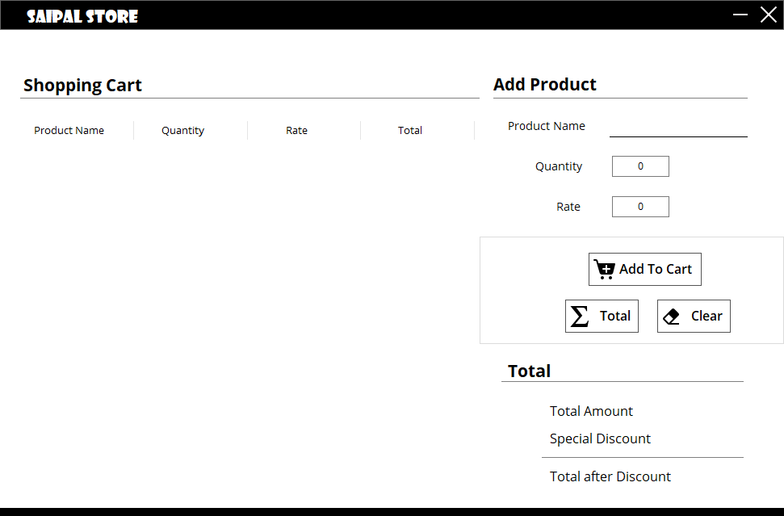

# question_02

Saipal Store has recently been opened in the heart of Tripureshwor. Since there are many departmental stores in the
  same area, the store has decided to offer a special discount on its opening day. The following table illust"Rate"s
  discounts based upon the different condition:

<table>
  <tr>
    <th>Purchase Amount</th>
    <th>Discount (%)</th>
  </tr>
  <tr>
    <td>Less than 1000</td>
    <td>2</td>
  </tr>
  <tr>
    <td>More or equal to 1000 but less than 10000</td>
    <td>5</td>
  </tr>
  <tr>
    <td>More or equal to 10000 but less than 20000</td>
    <td>8</td>
  </tr>
  <tr>
    <td>More or equal to 20000 but less than 50000</td>
    <td>10</td>
  </tr>
  <tr>
    <td> More or equal to 50000</td>
    <td>15</td>
  </tr>
</table>

  The shop has decided to develop a computer program <b>preferably a GUI</b> based application that would read the
  details of the purchase made which include the information of <ins>"Product Name"</ins>, <ins>"Rate"</ins> and
  <ins>"Quantity"</ins> and <b>the "Amount" and the "Total Amount" be automatically calculated</b>.<i>The program should
    automatically calculate the discount amount and the amount to be paid by the customer.</i>

  
<h1>Documentation</h1>
<h2>Installation</h2>
<h3>Requirements</h3>

  The program is written purely in C#. To compile and run this program, you need to have Visual Studio installed
  alongside .NET 4.5.

<h3>Instructions</h3>

  Here are the instructions to compile and run the program:
  <ol>
    <li>Clone or Download this repository.</li>
    <li>Extract downloaded zip files. <i>(Only if you have downloaded this repository.)</i></li>
    <li>Open <b>SaipalStore.sln</b> in <b>Visual Studio</b>. </li>
    <li>Click on <b>Build and Run</b> in the tool bar.</li>
  </ol>

<h2>Program</h2>

After you successfully build and run the program, it runs a console window which looks similar to this. 
   
  There are four major fields in the application, <b>Data View Area</b>, <b>
    Data Entry Area</b>, <b>Button Area</b>, and <b>Final Display Area
  </b> as shown in image here here.  
  
   
  <table>
    <thead>Legend</thead>
    <tr>
      <th>Color</th>
      <th>Index of</th>
    </tr>
    <tr>
      <td>Red</td>
      <td>Data View Area</td>
    </tr>
    <tr>
      <td>Green</td>
      <td>Data Entry Area</td>
    </tr>
    <tr>
      <td>Black</td>
      <td>Button Area</td>
    </tr>
    <tr>
      <td>Blue</td>
      <td>Final Display Area</td>
    </tr>
  </table>
  <h4>1. Data View Area</h4>
  In Data View Area, the data entered by the user can be viewed. In this area, there's a DataGridView where the data
  entered by the user is shown. The DataGridView has a table with four columns; "Product Name", "Quantity", "Rate" and
  "Total".
  "Product Name" stores the name of product entered by user, "Quantity" stores the amount of data, "Rate" shows the
  price per
  item. All these data can be entered through the Data Entry Area. Based on "Quantity" and "Rate", the app automatically
  calculates the "Total" which is the total price for each product.
  <h4>2. Data Entry Area</h4>
  In this area, there are text boxes that are used to enter the data. The data entered here is added to the DataGridView
  once "Add to Cart" button is clicked. There are three areas where you can enter the data; "Product Name", "Quantity",
  and "Rate".
  <h4>3. Button Area</h4>
  There are three buttons in this area which are "Add to Cart", "Clear" and "Total". "Add to Cart" button adds the data
  entered inside the textbox by the user into the DataGridView. "Clear" clears all the textbox, and "Total Amount",
  "Discount" and "Total after Discount" fields as well as the DataGridView table. The "Total" button calculates the
  "Total Amount", "Discount", and "Total after Discount" and displays them in the Final Display Area below.
  <h4>4. Final Display Area</h4>
  The Final Display Area displays the "Total Amount", "Discount", and "Total after Discount" after the calculations have
  been completed when the user clicks on "Total" button.  
  <h3>Entering the Data</h3>
  To enter the data, navigate to Data Entry Area, enter the data inside the textboxes, and click on "Add to Cart"
  button.
  The end result will look like this.  
   
  <h3>Calculating and Display Discount and Total</h3>
  After you have entered the data, click on "Total" button to display the "Total Amount", "Discount", and "Total after
  Discount".
  <h3>Clearing the Data</h3>
  After you finish the operations, you can clear the data fields as well as your shopping cart by clicking on "Clear"
  button.
  <h3>Minimizing and Closing the Application</h3>
  You can minimize the application by clicking on the  button
  that you find on the titleBar. Similarly, you can close the Application by clicking on the  button next to it.

<h2>Known Errors</h2>

   
   

